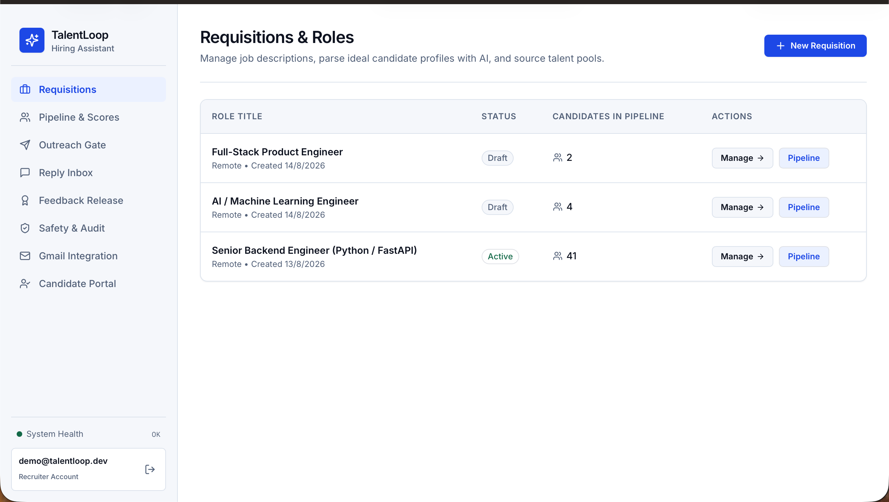
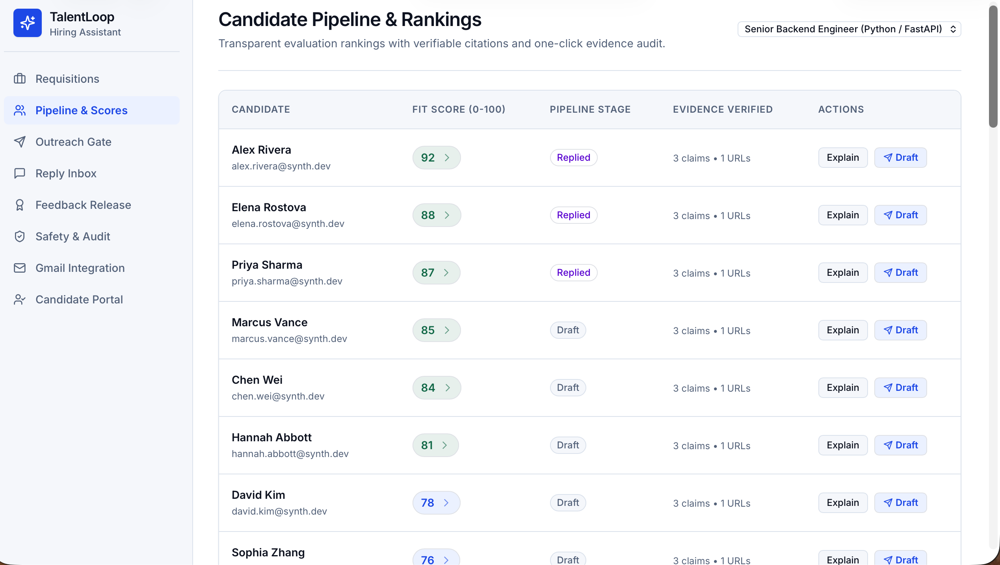
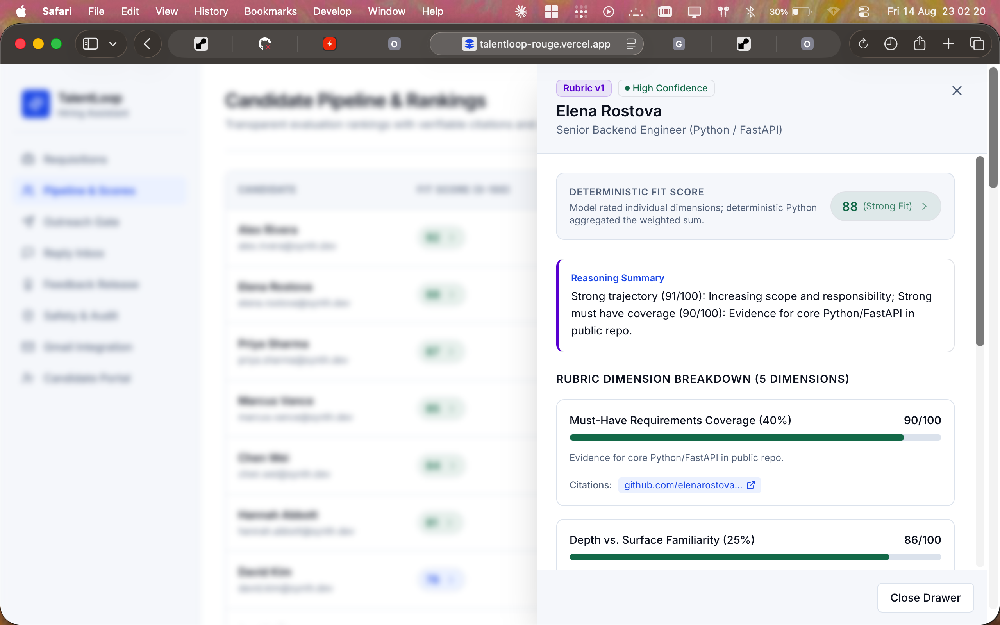
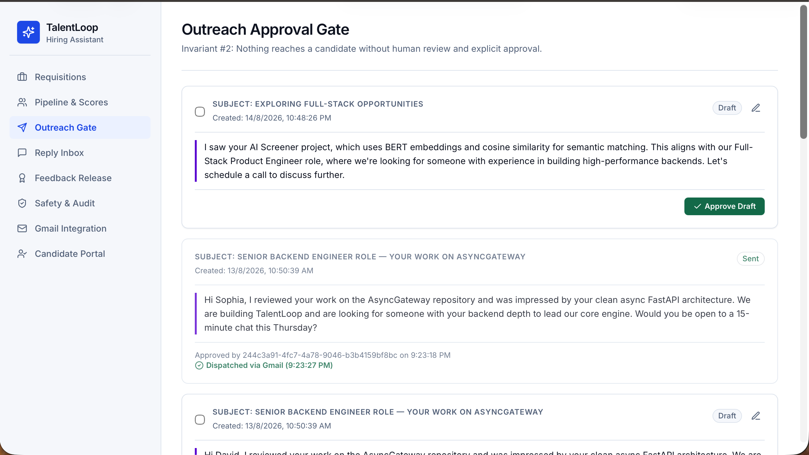
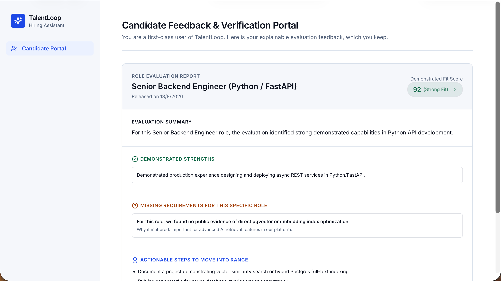
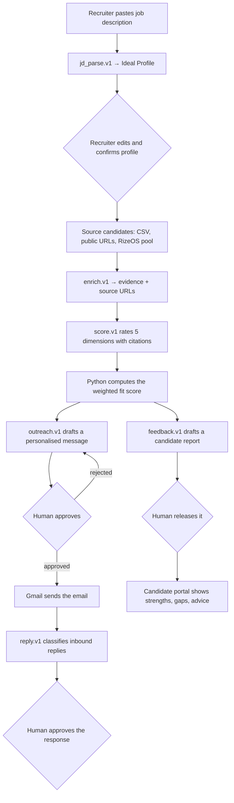
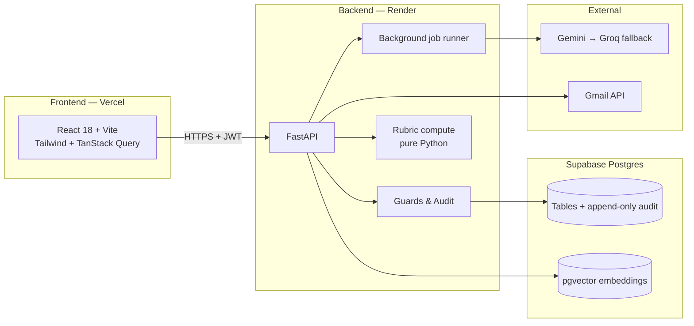

# TalentLoop — Agentic Hiring Assistant

**Team 000 · RizeOS Hackathon 2026 · Round 3 Final Showcase · AI Track + Full-Stack Track**

TalentLoop reads a job description, sources and researches candidates, scores them against a
transparent rubric with citations, drafts personalised outreach, triages replies, and returns a
feedback report to every rejected candidate — with a human approving anything that leaves the
system.

---

## 1. Live Links

| | |
|---|---|
| **Recruiter Dashboard** | https://talentloop-rouge.vercel.app/requisitions |
| **Candidate Portal** | https://talentloop-rouge.vercel.app/portal |
| **API / Swagger Docs** | https://talentloop-api.onrender.com/docs |
| **Health Check** | https://talentloop-api.onrender.com/api/v1/health |
| **GitHub Repository** | https://github.com/FasterThanAi/talentloop |
| **Demo Video (3 min)** | https://youtu.be/E8CvX2cyF_4 |
| **Pitch Deck (PDF)** | [docs/TalentLoop_Round3_Pitch_Deck.pdf](docs/TalentLoop_Round3_Pitch_Deck.pdf) |

### Login credentials

| Role | Email | Password |
|---|---|---|
| Recruiter | `demo@talentloop.dev` | `password123` |
| Candidate | `alex.rivera@synth.dev` | `password123` |
| Candidate | `david.kim@synth.dev` | `password123` |

You can also use **Sign in with Google** on the login page. Recruiter and candidate see
completely different applications — the same account cannot do both.

> **Note on the free hosting tier:** the Render backend sleeps when idle. The first request
> after a pause takes 30–50 seconds to wake it. Open the Health Check link first and wait for
> JSON to appear, then use the dashboard.

---

## 2. The Problem

A single job posting attracts hundreds of applicants. What happens today:

- Recruiters read the first ~40 résumés and stop. Good candidates are never seen.
- Screening is done by keyword match, so it rewards people who write the right words rather
  than people who did the work.
- Rejected candidates get silence, or a template. They learn nothing.
- When a candidate asks "why was I rejected?", nobody can answer with evidence.

Most "AI recruiting" tools make this worse, not better: an opaque model produces a number, the
recruiter trusts the number, and no one can explain it afterwards.

## 3. What TalentLoop Does Differently

TalentLoop is built on two rules that shape the entire codebase.

### Invariant 1 — The model never produces the final score

The LLM rates **individual rubric dimensions** and must cite evidence for each rating.
Deterministic Python in [`backend/app/rubric/compute.py`](backend/app/rubric/compute.py) then
performs the weighted aggregation and applies confidence caps.

| Rubric dimension (v1) | Weight |
|---|---|
| Must-have requirement coverage | 40% |
| Depth vs. surface familiarity | 25% |
| Domain and context relevance | 15% |
| Nice-to-have skills evidenced | 10% |
| Growth and ownership trajectory | 10% |

Why this matters: the score is reproducible, auditable, and adjustable. A recruiter who
disagrees with the weighting can change a number in a rubric file — not re-prompt a black box.
CI enforces it: a build fails if the scoring prompt is ever edited to ask for an overall score.

### Invariant 2 — Nothing reaches a human without explicit approval

No email is sent, no feedback report is released, and no candidate-visible artifact leaves the
system automatically. Every outbound action passes through the guards in
[`backend/app/core/guards.py`](backend/app/core/guards.py) and is written to an append-only
audit log. CI fails the build if any send path is added that bypasses the approval guard.

---

## 4. Screenshots

| Recruiter dashboard | JD parsed into an ideal profile |
|---|---|
|  |  |

| Explainable fit score with citations | Approval gate before any email is sent |
|---|---|
|  |  |

| Candidate portal — feedback report |
|---|
|  |

---

## 5. How It Works — the full loop



**Step by step, in plain terms:**

1. **Parse the job description.** The recruiter pastes raw JD text. `jd_parse.v1` turns it into
   a structured ideal profile — must-haves, nice-to-haves, seniority, domain, location. The
   recruiter can edit every field before anything else runs. Nothing is inferred silently.
2. **Source candidates.** Three consent-safe channels: CSV upload, explicit public profile URLs
   (GitHub, portfolio), or the RizeOS talent pool. No scraping of private data. Duplicate
   detection stops the same person being added twice.
3. **Research evidence.** `enrich.v1` reads the public pages the recruiter supplied and extracts
   skills, projects, and seniority signals — each with the URL it came from. If it cannot find
   evidence for something, it says so instead of guessing.
4. **Score against the rubric.** `score.v1` rates each of the five dimensions and cites the
   evidence for each rating. Citations are then verified against the stored evidence URLs, so a
   fabricated link is stripped before a human ever sees it. Python computes the final number.
5. **Draft outreach.** `outreach.v1` writes a short message that references one specific thing
   the candidate actually built. Generic mail-merge text is what candidates ignore.
6. **Approve and send.** The recruiter reads the draft, edits it if needed, and clicks Approve.
   Only then can Send be pressed. Both actions are audited with a timestamp and a user ID.
7. **Triage replies.** `reply.v1` classifies inbound email — interested, not interested,
   question, scheduling — drafts a response, and waits for approval again.
8. **Close the loop with the candidate.** `feedback.v1` turns the score breakdown into a
   readable report: what was strong, what was missing, and what to do about it. Every claim in
   the report is checked against the score breakdown it came from — a CI eval fails if the
   report says anything the breakdown does not support. The recruiter releases it deliberately.

**Bias controls.** The data sent to the scoring model is sanitised first: name, photo, age,
gender, and institution prestige are stripped. Only skills, evidence quotes, projects, and
seniority signals are passed. Matched-pair bias probes run in CI and fail the build if two
identical profiles differing only by name score differently beyond tolerance.

---

## 6. AI / LLM Pipeline

Everything the model does goes through one runner, so behaviour is consistent across all eight
prompts.

**Versioned prompt library** — [`backend/app/ai/prompts/`](backend/app/ai/prompts/)

| Prompt | Purpose |
|---|---|
| `jd_parse.v1` | Job description → structured ideal profile |
| `enrich.v1` | Public pages → evidence, skills, projects, source URLs |
| `score.v1` | Evidence + profile → per-dimension ratings with citations |
| `outreach.v1` | Evidence + profile → personalised draft email |
| `reply.v1` | Inbound email → intent, sentiment, priority, suggested action |
| `respond.v1` | Candidate question → grounded answer, or a refusal to answer |
| `feedback.v1` | Score breakdown → candidate-facing feedback report |
| `interview.v1` | Score gaps → targeted interview questions |

Prompts are files, not string literals in code. Changing one requires a version bump and passes
through the CI eval gate.

**Structured output.** Every call declares a Pydantic schema and is validated on return. A
malformed response is retried once, then raised as `AIValidationError` and surfaced to the user
as a readable problem-detail response — never as a half-parsed object written to the database.

**Error handling and latency management** — [`backend/app/ai/client.py`](backend/app/ai/client.py)

- **Provider fallback chain.** Gemini is primary; on a quota or rate-limit error the request
  fails over to **Groq** immediately rather than retrying a provider that has already said no.
  Order is configurable via `AI_PROVIDER_ORDER`. This was added after the Gemini free tier's
  daily cap ended a test run mid-demo.
- **Timeouts.** A 45-second cap per generation, with two attempts per provider.
- **No event-loop blocking.** Every blocking SDK call runs in `asyncio.to_thread`. A single
  synchronous call inside an async handler freezes the whole server on a one-worker deployment,
  which is exactly what happened before this was fixed.
- **Background jobs.** Sourcing, enrichment, and scoring run as tracked jobs with live progress,
  per-item error capture, and idempotency keys, so one bad candidate cannot fail a batch.
- **Loud degradation.** With no API key configured the system runs on canned responses — and
  says so, in the startup log, in `/api/v1/health` (`ai_mode: MOCK`), and as a banner in the UI.
  It is deliberately impossible to demo on mock data by accident.

**Retrieval gate.** When a candidate asks a question in the portal, the answer must be grounded
in the company knowledge corpus. If nothing clears the relevance threshold, `respond.v1` is
instructed to defer rather than answer. Semantic search uses pgvector on Postgres, with a
keyword fallback on SQLite.

---

## 7. Architecture



**Tech stack**

| Layer | Choice |
|---|---|
| Frontend | React 18, Vite 5, Tailwind CSS 3, TanStack Query 5, React Router 6 |
| Backend | Python 3.12, FastAPI, Pydantic v2, SQLAlchemy 2.0, Alembic |
| Database | PostgreSQL (Supabase) with pgvector; SQLite for local development |
| AI | Google Gemini (primary), Groq Llama 3.3 70B (fallback) |
| Auth | JWT access tokens + httpOnly refresh cookie, Google OAuth sign-in, Gmail OAuth |
| Hosting | Render (API), Vercel (SPA), Supabase (database) |
| CI | GitHub Actions — lint, migrations, unit tests, blocking eval gate, acceptance audit |

**Data model** — organizations, users, requisitions, candidates, candidate_research,
pipeline_entries, outreach_messages, replies, feedback_reports, knowledge_chunks, credentials,
jobs, audit_events. Every table is org-scoped; every mutation writes an audit row inside the
same transaction, so an action and its audit trail commit or roll back together.

---

## 8. API Surface

Full interactive documentation: **https://talentloop-api.onrender.com/docs**

| Area | Endpoints |
|---|---|
| Auth | `POST /auth/register` · `POST /auth/login` · `POST /auth/refresh` · `POST /auth/logout` · `GET /auth/me` · `GET /auth/google/login` · `GET /auth/google/callback` · `GET /auth/gmail/connect` |
| Requisitions | `GET/POST /requisitions` · `GET/PUT /requisitions/{id}` · `POST /requisitions/{id}/parse` · `POST /requisitions/{id}/score` · `POST /requisitions/{id}/send-approved` · `POST /requisitions/{id}/feedback/release-all` |
| Sourcing | `POST /sourcing/csv` · `POST /sourcing/urls` · `POST /sourcing/rizeos-pool` |
| Pipeline | `GET /pipeline` · `GET /pipeline/{id}` · `GET /pipeline/{id}/explain` · `POST /pipeline/{id}/score` · `POST /pipeline/{id}/draft` · `POST /pipeline/{id}/feedback/generate` · `POST /pipeline/{id}/feedback/release` · `POST /pipeline/{id}/interview/generate` |
| Outreach | `GET /outreach` · `PUT /outreach/{id}` · `POST /outreach/{id}/approve` · `POST /outreach/{id}/send` |
| Replies | `POST /replies/sync` · `POST /replies/{id}/classify` · `POST /replies/{id}/draft-response` · `POST /replies/{id}/approve` · `POST /replies/{id}/send` |
| Candidates | `GET /candidates` · `POST /candidates/{id}/do-not-contact` · `GET /candidates/{id}/data-export` · `DELETE /candidates/{id}/data` |
| Knowledge | `GET/POST /knowledge` · `GET /knowledge/search` · `POST /knowledge/embed-missing` |
| Portal | `GET /me/feedback` · `POST /feedback/{id}/credential` · `GET /credentials/{hash}/verify` |
| Ops | `GET /health` · `GET /jobs/{id}` · `GET /audit` |

All errors follow RFC 7807 problem-detail format with a stable machine-readable `code`.

---

## 9. Responsible AI & Data Handling

| Concern | How it is handled |
|---|---|
| Score explainability | Every dimension carries a justification and verified source URLs |
| Hallucinated citations | Citations not present in stored evidence are stripped before display |
| Bias | Identity attributes removed before scoring; matched-pair probes gate CI |
| Consent | Candidates are sourced only from CSV, explicitly supplied public URLs, or the RizeOS pool |
| Do-not-contact | One click permanently blocks all outbound contact, re-checked immediately before every send |
| Right to access | `GET /candidates/{id}/data-export` returns everything held about a person |
| Right to erasure | `DELETE /candidates/{id}/data` removes personal data and keeps the audit trail |
| Accountability | Append-only `audit_events` records actor, action, entity, and payload for every mutation |
| Candidate dignity | Rejected candidates receive a specific, actionable report instead of silence |

---

## 10. Run It Locally

Prerequisites: Python 3.12+, Node 18+, and a Gemini or Groq API key (optional — it runs on mock
data without one, and tells you it is doing so).

```bash
git clone https://github.com/FasterThanAi/talentloop.git
cd talentloop

# Backend
cd backend
python3 -m venv .venv && source .venv/bin/activate
pip install -r requirements.txt
cp .env.example .env          # add GEMINI_API_KEY and/or GROQ_API_KEY
alembic upgrade head
python -m app.seed --demo     # demo org, requisition, candidates, replies
uvicorn app.main:app --reload --port 8000

# Frontend (second terminal)
cd frontend
npm install
cp .env.example .env
npm run dev
```

- Recruiter dashboard — http://localhost:5173 (`demo@talentloop.dev` / `password123`)
- Candidate portal — http://localhost:5173/portal (`alex.rivera@synth.dev` / `password123`)
- API docs — http://localhost:8000/docs
- Health — http://localhost:8000/api/v1/health

### Environment variables

| Variable | Purpose |
|---|---|
| `DATABASE_URL` | Postgres URI (Supabase **session pooler**, port 5432). SQLite is dev-only |
| `GEMINI_API_KEY` / `GEMINI_MODEL` | Primary AI provider |
| `GROQ_API_KEY` / `GROQ_MODEL` | Fallback provider used when Gemini hits its quota |
| `AI_PROVIDER_ORDER` | Provider chain, default `gemini,groq` |
| `JWT_SECRET` / `ENCRYPTION_KEY` | Token signing and OAuth token encryption at rest |
| `GMAIL_CLIENT_ID` / `GMAIL_CLIENT_SECRET` | Gmail send + Google sign-in OAuth client |
| `GOOGLE_REDIRECT_URI` / `GMAIL_REDIRECT_URI` | Both must be registered in Google Cloud Console |
| `CORS_ORIGINS` | Exact deployed frontend origin — no trailing slash |
| `FRONTEND_URL` | Where the backend returns the browser after OAuth |
| `APP_ENV` | `production` switches cookies to `SameSite=None; Secure` for cross-site auth |

Frontend needs one variable: `VITE_API_BASE_URL=https://talentloop-api.onrender.com/api/v1`.

Full deployment walkthrough: [`docs/DEPLOYMENT.md`](docs/DEPLOYMENT.md).

---

## 11. Testing & CI

```bash
./scripts/verify.sh               # migrations, tests, evals, config sanity
python3 scripts/audit_phases.py   # every phase acceptance criterion, checked statically
```

GitHub Actions runs on every push and pull request:

1. **Lint** — ruff across the backend
2. **Migrations** — Alembic applies cleanly to an empty database
3. **Unit tests** — rubric maths, guards, idempotency, SSRF protection, job registration,
   provider fallback, response gate, audit integrity
4. **Eval gate (blocking)** — matched-pair bias probes, scoring rank correlation against a
   human baseline, feedback fidelity
5. **Invariant checks** — the scoring prompt must never request an overall score; no send path
   may bypass the approval guard
6. **Acceptance audit** — every documented phase criterion is still met

The eval job is a gate, not a report. A prompt change that shifts a bias probe past tolerance
fails the build.

---

## 12. Repository Layout

```
talentloop/
├── backend/
│   ├── app/
│   │   ├── ai/            # provider client, runner, versioned prompt library
│   │   ├── api/v1/        # HTTP routes
│   │   ├── core/          # config, auth, guards, audit, vector, idempotency
│   │   ├── jobs/          # background sourcing, enrichment, scoring
│   │   ├── models/        # SQLAlchemy models
│   │   ├── rubric/        # dimensions + deterministic scoring (Invariant 1)
│   │   ├── schemas/       # Pydantic contracts
│   │   ├── seed/          # demo data
│   │   └── services/      # business logic
│   ├── alembic/           # migrations
│   └── tests/             # unit tests + blocking evals
├── frontend/
│   └── src/
│       ├── app/           # router, providers
│       ├── components/ui/ # design-system components
│       ├── features/      # requisitions, pipeline, outreach, replies, portal
│       └── lib/           # API client with silent token refresh
├── docs/                  # deployment, git workflow, demo script, screenshots, prompts
├── scripts/               # verify.sh, audit_phases.py
└── .github/workflows/     # CI with blocking eval gate
```

---

## 13. Known Limits

Stated plainly, because a demo that hides its edges is not useful.

- Enrichment reads public pages the recruiter supplies. It does not scrape LinkedIn or any
  platform whose terms forbid it.
- The free hosting tier sleeps when idle; the first request after a pause is slow.
- The Gemini free tier allows very few generations per day. The Groq fallback exists precisely
  because of this and takes over automatically.
- Scoring quality depends on the evidence available. Candidates with no public work receive a
  low-confidence score, and the UI labels it as such rather than pretending to certainty.
- The credential anchor is behind a feature flag and is not part of this submission.

---

## 14. Team

**Team 000**

| Name | GitHub | Focus |
|---|---|---|
| Pranav Somnath Undirkalle | [@pranavuk](https://github.com/pranavuk) | Backend, data model, migrations, documentation and README |
| Vineet Ramayya Polampalli | [@vineeth34064](https://github.com/vineeth34064) | Frontend, design system, candidate portal |
| Raj Gautam | [@RajGautam2004](https://github.com/RajGautam2004) | AI pipeline, prompt library, evals |
| Priyanshu Kumar | [@FasterThanAi](https://github.com/FasterThanAi) | Architecture, backend, deployment, CI, integration |

Built for the **RizeOS Hackathon 2026** — AI Track and Full-Stack Track.

---

## 15. Further Documentation

| Document | Contents |
|---|---|
| [`docs/DEPLOYMENT.md`](docs/DEPLOYMENT.md) | Render + Vercel + Supabase deployment, step by step |
| [`docs/TalentLoop_Round3_Pitch_Deck.pdf`](docs/TalentLoop_Round3_Pitch_Deck.pdf) | Round 3 pitch deck |
| [`docs/demo-script.md`](docs/demo-script.md) | The three-minute demo path |
| [`docs/GIT-WORKFLOW.md`](docs/GIT-WORKFLOW.md) | Branching, review, and merge process |
| [`docs/prompts/api-contract.md`](docs/prompts/api-contract.md) | Full API contract |
| [`docs/prompts/ui-system.md`](docs/prompts/ui-system.md) | Design system rules |
| [`CLAUDE.md`](CLAUDE.md) | Engineering context and non-negotiables |
